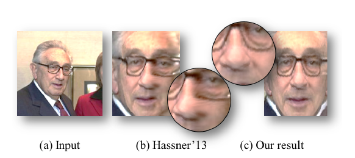
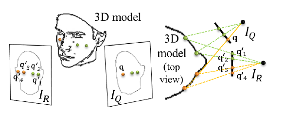
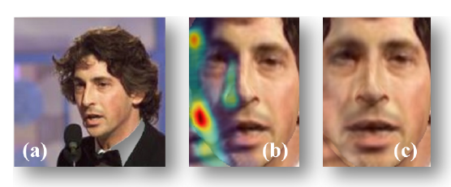
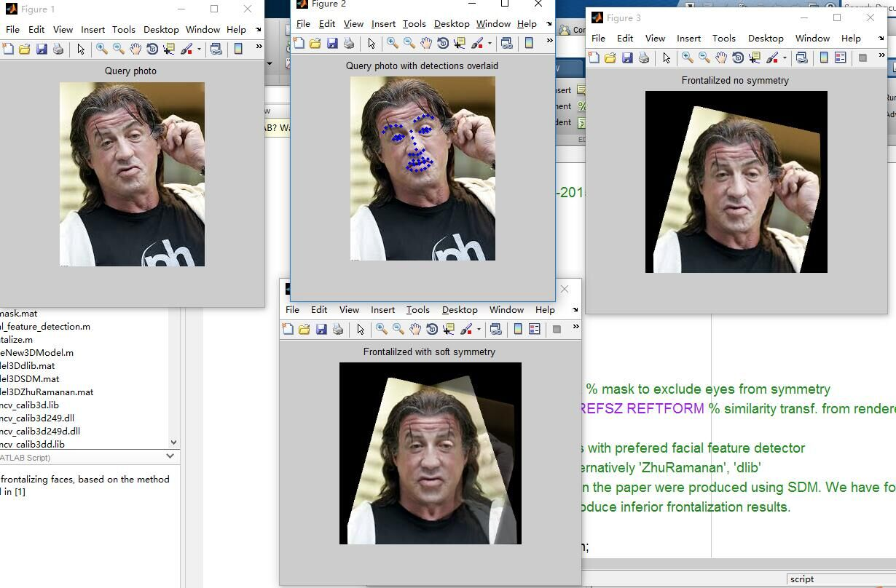
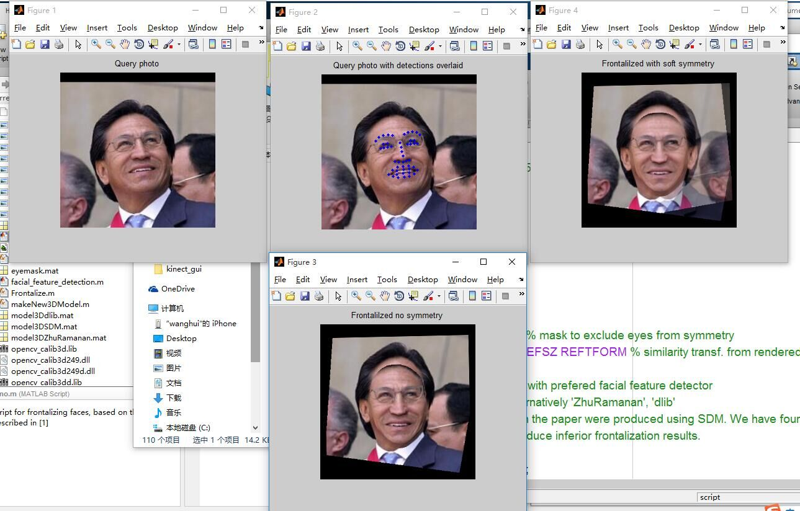

Effective Face Frontalization in Unconstrained Images  
在无约束图片中的有效人脸摆正

* Tal Hassner   
* Shai Harel   
* Eran Paz
* Roee Enbar

## 人脸摆正

  
"Frontalization"是将无约束的人脸照片和校正后的正脸合成的过程。研究发现图片经过这个过程后可以大幅提高人脸识别系统的性能和识别准确率。  
在最初的时候作者试图为每个输入图片建立一个3D模型，然后发现这种实现会很困难，而且容易引起面部失调。  
于是作者最终采用了一种更简单的方法，从标准正脸3D模型影射回2d图片然后采用对称复制的方法实现这个过程。    

## 完整过程

a：输入的原始图片，图中是一张人脸的侧脸图  
b：检测出人脸关键点  
c：用相同的人脸关键点算法检测出系统提供的标准正脸3D模型的关键点，生成一个3D计算机模型  
d、e：利用原始图片的人脸关键点坐标与其对应的标准正脸3D模型的关键点坐标，可以得出一个坐标投影矩阵，用于将原始图片的像素点反投影到标准正脸坐标系中    
f：将正脸图覆盖到原始图片后，计算出面部非正脸部分的可见性，热点图显示区域表示非正脸的像素，这些区域的图片借助正脸对称的位置来填充显示  
g：输出的摆正后的正脸结果

## 人脸摆正中的重难点

#### 生成正脸图
人脸的检测使用现成的人脸关键点结果，然后借助标准的3D正脸模型坐标系统经行坐标调整。
* 面部特征检测：  
采用兼顾速度和特征检测准确性的SDM方法，画出的人脸关键点没有包括人的下巴，这些关键点会更接近3D平面的正面
* 姿态估算  
用相同的方法在标准3D正脸图中生成关键点，与原始图片的人脸关键点坐标比对，生成一个坐标投影矩阵，利用这个投影矩阵，反投影出原始图片的像素点，这些像素点将构成我们需要的正脸图。
* 合成正脸图  
 将得到的正脸图片覆盖到原始图片上。

#### 对称处理和可见度估算
对称处理：经过投影矩阵反投影后，会使得人脸的部分区域的可见度比其他地方更小，特别是鼻子和头部的边缘。这时需要做一些处理：  

a：输入图片  
b：在人脸特征点闭合的地方会出现类似涂抹拉伸的痕迹显得很模糊  
c：利用正脸对称位置来填充这些部分

可见度估算：使用类似于采用多视图三维重建的方法，使用一个与3D相似的模型和平面IR来计算IQ的可见度。

正脸坐标IR中的像素点q3和q4都被影射到输入图片的平面IQ上的像素点q，所以它们的可见度会更低。它们对称的点q1和q2用来预测他们在正面视图中应出现的位置。

a：输入图片  
b：计算覆盖在原始图片上的可见度，热点图表示可见度更少的区域  
c：对称后的正脸  
#### 进一步对称处理
对称处理能得到想要的结果，但是在一些特殊的图片中，因为脸部被遮挡的原因，还需要被进一步处理。

这两张图可以看出，对称处理后不是我们想要的结果，需要检测出对称的错误。  
当人脸的不可见部分是被除去人脸的遮挡物遮挡时，就需要在此基础上进行修正：

定位出原始图片人脸的八个区域，主要对应嘴、鼻子和眼睛的周围区域，然后训练8个线性的SVM分类器，每一个分类器的训练图片是正视的人脸对应区域，由此得到LBP特征描述子，给定一张待矫正图片，对其进行同样的分块，用训练好的SVM分类器判断每块区域是否是可见部分，若是可见部分，则丢弃对称的人脸部分，若不是，则填充到前面生成的正脸图对应区域。

#### 实际代码及运行效果
下载官网（http://www.openu.ac.il/home/hassner/projects/frontalize/）提供的代码后，能自行输入人脸图片测试人脸摆正的效果。

demo.m文件设置参数和图片：

        addpath calib

        % 载入待摆正的测试图
        I_Q = imread('test.jpg'); 

        % load some data
        load eyemask eyemask % mask to exclude eyes from symmetry
        load DataAlign2LFWa REFSZ REFTFORM % similarity transf. from rendered view to LFW-a coordinates

        % Detect facial features with prefered facial feature detector 
        detector = 'SDM'; % alternatively 'ZhuRamanan', 'dlib'
        % Note that the results in the paper were produced using SDM. We have found
        % other detectors to produce inferior frontalization results. 
        fidu_XY = [];
        facial_feature_detection;
        if isempty(fidu_XY)
            error('Failed to detect facial features / find face in image.');
        end

        % Estimate projection matrix C_Q
        [C_Q, ~,~,~] = estimateCamera(Model3D, fidu_XY);

        % Render frontal view
        [frontal_sym, frontal_raw] = Frontalize(C_Q, I_Q, Model3D.refU, eyemask);

        % Apply similarity transform to LFW-a coordinate system, for compatability
        % with existing methods and results
        frontal_sym = imtransform(frontal_sym,REFTFORM,'XData',[1 REFSZ(2)], 'YData',[1 REFSZ(1)]);
        frontal_raw = imtransform(frontal_raw,REFTFORM,'XData',[1 REFSZ(2)], 'YData',[1 REFSZ(1)]);
            

        % Display results
        figure; imshow(I_Q); title('Query photo');
        figure; imshow(I_Q); hold on; plot(fidu_XY(:,1),fidu_XY(:,2),'.'); hold off; title('Query photo with detections overlaid');
        figure; imshow(frontal_raw); title('Frontalilzed no symmetry');
        figure; imshow(frontal_sym); title('Frontalilzed with soft symmetry');

Frontalize.m文件为核心文件：

        function [frontal_sym, frontal_raw] = Frontalize(C_Q, I_Q, refU, eyemask)                                         
        % Actual frontalization function. This is part of the distribution for
        % face image frontalization ("frontalization" software), described in [1].
        %
        % If you find this code useful and use it in your own work, please add
        % reference to [1].
        %
        % Please see project page for more details:
        %   http://www.openu.ac.il/home/hassner/projects/frontalize
        %
        % Please see demo.m for example usage.
        %
        % Input: 
        %   C_Q: Estimated camera projection matrix used to produce the query photo. 
        %       Computed by estimateCamera.m
        %   I_Q: Query photo
        %   refU: NxMx3 matrix assigning each pixel in the reference (frontalized
        %       coordinate system, the 3D coordinates of the surface of the face
        %       projected onto that pixel. Available from Model3D.refU
        %   eyemask: NxMx3 matrix with alpha weights for the eyes, in order to
        %       exclude them from the symmetry.
        %
        % Output:
        %   frontal_sym: Synthesized frontal view using soft symmetry.
        %   frontal_raw: Synthesized frontal view without (before) soft symmetry.
        %
        %  References:
        %   [1] Tal Hassner, Shai Harel, Eran Paz, Roee Enbar, "Effective Face
        %   Frontalization in Unconstrained Images," forthcoming. 
        %   See project page for more details: 
        %   http://www.openu.ac.il/home/hassner/projects/frontalize
        %
        %   Copyright 2014, Tal Hassner
        %   http://www.openu.ac.il/home/hassner/projects/frontalize
        %
        %
        %   The SOFTWARE ("frontalization" and all included files) is provided "as is", without any
        %   guarantee made as to its suitability or fitness for any particular use.
        %   It may contain bugs, so use of this tool is at your own risk.
        %   We take no responsibility for any damage that may unintentionally be caused
        %   through its use.
        %
        %   ver 1.2, 18-May-2015
        %
            ACC_CONST = 800; 
            I_Q = double(I_Q);

            bgind = sum(abs(refU),3)==0;

            % count the number of times each pixel in the query is accessed
            threedee = reshape(refU,[],3)';
            tmp_proj = C_Q * [threedee;ones(1,size(threedee,2))];
            tmp_proj2 = tmp_proj(1:2,:)./ repmat(tmp_proj(3,:),2,1);
            

            bad = min(tmp_proj2)<1 | tmp_proj2(2,:)>size(I_Q,1) | tmp_proj2(1,:)>size(I_Q,2) | bgind(:)';
            tmp_proj2(:,bad) = [];

            ind = sub2ind([size(I_Q,1),size(I_Q,2)], round(tmp_proj2(2,:)),round(tmp_proj2(1,:)));

            synth_frontal_acc = zeros(size(refU,1),size(refU,2));
            
            ind_frontal = 1:(size(refU,1)*size(refU,2));
            ind_frontal(bad) = [];
                
            [c,~,ic] = unique(ind);
            count = hist(ind,c);
            synth_frontal_acc(ind_frontal) = count(ic);

            synth_frontal_acc(bgind) = 0;
            synth_frontal_acc = imfilter(synth_frontal_acc,fspecial('gaussian', 16, 30),'same','replicate');
            
            % create synthetic view, without symmetry
            c1 = I_Q(:,:,1); f1 = zeros(size(synth_frontal_acc));
            c2 = I_Q(:,:,2); f2 = zeros(size(synth_frontal_acc));
            c3 = I_Q(:,:,3); f3 = zeros(size(synth_frontal_acc));
            
            f1(ind_frontal) = interp2(c1, tmp_proj2(1,:), tmp_proj2(2,:), 'cubic'); 
            f2(ind_frontal) = interp2(c2, tmp_proj2(1,:), tmp_proj2(2,:), 'cubic'); 
            f3(ind_frontal) = interp2(c3, tmp_proj2(1,:), tmp_proj2(2,:), 'cubic'); 
            frontal_raw = cat(3,f1,f2,f3);
            
            % which side has more occlusions?
            midcolumn = round(size(refU,2)/2);
            sumaccs = sum(synth_frontal_acc);
            sum_left = sum(sumaccs(1:midcolumn));
            sum_right = sum(sumaccs(midcolumn+1:end));
            sum_diff = sum_left - sum_right;
            
            if abs(sum_diff)>ACC_CONST % one side is occluded
                if sum_diff > ACC_CONST % left side of face has more occlusions
                    weights = [zeros(size(refU,1),midcolumn), ones(size(refU,1),midcolumn)];
                else % right side of face has occlusions
                    weights = [ones(size(refU,1),midcolumn), zeros(size(refU,1),midcolumn)];
                end
                weights = imfilter(weights, fspecial('gaussian', 33, 60.5),'same','replicate');
               
                % apply soft symmetry to use whatever parts are visible in ocluded
                % side
                synth_frontal_acc = synth_frontal_acc./max(synth_frontal_acc(:));
                weight_take_from_org = 1./exp(0.5+synth_frontal_acc);%
                weight_take_from_sym = 1-weight_take_from_org;
                
                weight_take_from_org = weight_take_from_org.*fliplr(weights);
                weight_take_from_sym = weight_take_from_sym.*fliplr(weights);
                
                weight_take_from_org = repmat(weight_take_from_org,[1,1,3]);
                weight_take_from_sym = repmat(weight_take_from_sym,[1,1,3]);
                weights = repmat(weights,[1,1,3]);
                
                denominator = weights + weight_take_from_org + weight_take_from_sym;
                frontal_sym = (frontal_raw.*weights + frontal_raw.*weight_take_from_org + flipdim(frontal_raw,2).*weight_take_from_sym)./denominator;
                
                % Exclude eyes from symmetry        
                frontal_sym = frontal_sym.*(1-eyemask) + frontal_raw.*eyemask;
                

            else %% both sides are occluded pretty much to the same extent -- do not use symmetry
                frontal_sym = uint8(frontal_raw);
            end
            frontal_raw = uint8(frontal_raw);
            frontal_sym = uint8(frontal_sym);
          
        end

系统提供的标准3D正脸图：  

输入图片后的实际运行效果：  

